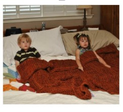
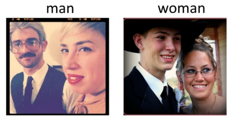
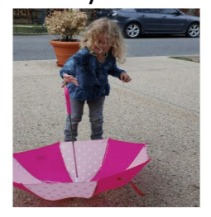

# VisualSearch - Visual LLM
This repository has 2 aspects. 
- Exploration of performance of different pipelines consisting of different LLM on VQA without explicit fune tuning.
- Based on the best performing pipeline, improve the search system for better search/recommendation system.
## LLM based visual question answering.
### Visual Question Answering (VQA)
Visual Question Answering (VQA) is the task of answering the posed
question on the image. This is particularly challenging as the
model has to know about the image content and then use the
information to answer the question. It is significant in the field
of LLMs as it will allow the LLM models to digest image. This is an active area of research topic by researchers introduced by the paper ([VQA-Paper](https://arxiv.org/abs/1505.00468)).       
Recent models on task of VQA: [LlaVA](https://github.com/haotian-liu/LLaVA)

#### Examples on VQA task:
**Question:** How many children are there in bed ?    
|  |  |    
|:----------------------:|:----------------------:|        
| Answer: 2 | Answer: 1 |    
          
**Question:** Who is wearing glasses in the photo ?          
         
<!-- Answer: Man (first image) , Woman (second image)         -->

**Question:** Is the umbrella upside down ?          
             
Answer: Yes          

### Background Information for our work
We will be using several models in tandem in our report, so to better understand our work, it is necessary to understand
about different models such as BLIP, YOLO, Llama and Mistral.

#### BLIP: Bootstrapping Language and Image Pre-training (BLIP) framework. 
This framework is flexible for both vision language understanding and 
generation tasks. This model is designed specifically for image captioning 
task.  Complete details of the model can be found [here](https://arxiv.org/pdf/2201.12086)      

_Purpose_:     
When provided with an image, BLIP outputs a descriptive caption, employing  
an attention mechanism to concentrate on various image segments before 
formulating a word sequence to create the caption.

<!-- 
**Brief on the model:**
- Pre-trained model on Common Objects in COntext (COCO) for descriptive 
  caption of the image.

_Structure:_   
BLIP model:
- patch embedding layer, 
- transformer encoder and
- language decoder.        

Initially, the patch embedding layer processes the input image, transforming it into a series of patch 
embeddings. Following this, the transformer encoder uses multiple 
self-attention layers to discern the interrelations among these patches, 
thus forming a contextual image representation. Subsequently, the language 
decoder utilizes this representation to produce a word sequence that comprises the
image’s caption.
-->
**Note:** We are using BLIP-1 model.

#### YOLO: You Only Look Once.
This framework is capable of detecting objects in an image at **real-time**.
Complete details of the model can be found [here](https://arxiv.org/pdf/1506.02640) 

_Purpose:_       
When provided an image, YOLO outputs bounding boxes for each of the 
trained objects present in the image along with their corresponding class 
names. YOLO is one-stage object detector.

**Note:** We are using YOLOv5 model.

#### LLama-2 
This autoregressive model is capable to follow instructions provided in the 
prompt context of the model and provide results in the generation task. 
Complete details of the model can be found [here](https://arxiv.org/pdf/2307.09288)
     
_Purpose:_           
The model would be able to follow instructions to answer the question based 
on the context provided to answer the question in the format required.
     
**Note:** meta-llama/Llama-2-7b-chat-hf     

#### Mistral-7B 
Similar to Llama-2, this autoregressive model is also capable to follow 
instructions provided in the prompt context of the model and provide results 
in the generation task. Complete details of the model can be found
[here](https://arxiv.org/pdf/2310.06825)
     
_Purpose:_           
The model would be able to follow instructions to answer the question based 
on the context provided to answer the question in the format required.
     
**Note:** mistralai/Mistral-7B-Instruct-v0.2

### Analysis
We will be exploring analysis on the following aspects.
<ol>
<li> Generation Configuration exploration </li>
<li> Pipeline exploration </li>
<li> Template exploration </li>
<li> In Contextual Learning(ICL) performance </li>
</ol>

Note: We will be performing the analysis based on the metrics, "Exact Match 
Accuracy", "Semantic Match Accuracy". The Exact Match Accuracy may not be 
right metric as LLM can provide synonym word as answer, so better metric 
would be 'Semantic Match Accuracy'. As the answers to the visual questions 
are single word answers, we were considering the first token output by LLM. 

#### Explored configurations:
The output of LLMs provided significant issue for evaluating the response, 
so we have experimented with 3 different configurations. Configurations:
- Default generation configuration
- Limit max_tokens = 3
- Limit max_tokens = 3 with prompt instruction to answer in a single word.

#### Pipelines for VQA

##### BLIP and LLM (Llama/Mistral)
The idea is to use captions of the image from blip-image captioning model. 
These captions would provide a brief description of the image. Using this 
image caption of the image, we test the performance of different large 
language model based on different prompts.

**Note:** This pipeline can work for answering questions on the image data 
which is based on description of data but was not effective at answering 
numerical questions as the caption would output the caption as 'Children are 
sleeping calmly in bed.'

##### YOLO and LLM (Llama/Mistral)
The idea is to use the information about the objects present in the image 
and their positions in the image. This information would enable us to 
address the answer the questions about the objects present in the image as 
BLIP model may not capture all the objects present in the image as they may 
not be critical to be included in the image caption.

**Note:** This pipeline faces issues when answering about the mood of the 
person or generic understanding of the content in the image which may not 
require details of the objects in the image.

##### BLIP, YOLO and LLM (Llama/Mistral)
This combination of both YOLO and BLIP models on the image would provide 
information about the generic information of the image and the objects 
present in the image along with their positions in the image. This 
augmented data will provide better understanding of the image for answering 
the question by LLM.

#### Explored prompts:
In this analysis, we will be exploring the performance of the pipeline for 
both quantized and un-quantized versions of the LLM models.
<ol>
<li> Prompt with model specified in prompt:  
<code>
"Based on the image caption(provided
by BLIP model) as ’{caption}’ and
detections(provided by Yolo) as
’{detections}’, answer in a single
word the question based on the image
details as question: ’{question}’
Answer:
</code>
</li>

<li> Prompts with Explicit Instruction for Single-Word Answer:  
<code>
"Using the image caption ’{caption}’
and detected objects ’{detections}’,
answer the following question with a
single word: ’{question}’.
Answer: "
</code>
</li>

<li> Direct Question without model information:  
<code>
"Caption: ’{caption}’. Detected
Objects: ’{detections}’. What is the
one-word answer to this question about
the image: ’{question}’?
Answer: "
</code>
</li>

<li> Focus on Image details:  
<code>
"Given the description ’{caption}’ and
identified elements ’{detections}’,
provide a one-word response to this
inquiry about the image: ’{question}’.
Answer: "
</code>
</li>

<li> Simplified Question-Response Style:  
<code>
"From the image caption ’{caption}’
and object detections ’{detections}’,
find the answer to: ’{question}’.
Respond in just one word.
Answer: "
</code>
</li>

<li> Structured as a Challenge:  
<code>
"Challenge: With the caption
’{caption}’ and objects detected
as ’{detections}’, determine the
single-word answer to the question:
’{question}’.
Answer: "
</code>
</li>

<li> Asking to answer question using Image content:  
<code>
"Answer in a single word for the
question: ’{question}’ using image
caption: ’{caption}’ and object
detections: ’{detections}’.
Answer:"
</code>
</li>
</ol>

#### In Contextual Learning(ICL) performance
The large language models have the ability to follow the task
which is famously known as in-context learning. Usually
providing few examples in the context enhances the model
performance, so we plan to explore the performance improvement using the 
same approach by providing some in context examples. 
For ICL, we explore
- Single Shot inference aka 1 in-context example.
- Few Shot inference (In-context examples)
  - 3 
  - 5

In interest of time, we will be exploring these templates on 100 samples.

### Results
<ol>
<li> Results of generation configuration:
Performance of various configuration of Yolo + Mistral

|          Configuration           |  Exact Match Accuracy  | Semantic Match Accuracy  |
|:--------------------------------:|:----------------------:|:------------------------:|
|             Default              |         0.1288         |          0.1522          |
|           Max 3 tokens           |         0.2159         |          0.2577          |
|Max 3 tokens + single word prompt |         0.4293         |          0.5209          |
</li>

<li> Pipeline exploration result:

Performance of best configuration from previous result i.e. BLIP + YOLO + 
LLM (with max 3 tokens and single word answer in prompt)

| Pipeline Configuration | Exact Match Accuracy | Semantic Match Accuracy |
|:----------------------:|:--------------------:|:-----------------------:|
|      BLIP + Llama      |        0.4542        |         0.5927          |
|      YOLO + Llama      |        0.471         |          0.63           |
|  BLIP + YOLO + Llama   |        0.461         |         0.6423          |
|     BLIP + Mistral     |        0.4293        |         0.5209          |
|     YOLO + Mistral     |        0.2923        |         0.3961          |
| BLIP + YOLO + Mistral  |        0.4542        |         0.5927          |

We observe that Llama performs better than Mistral on all the pipeline 
configurations.     
</li>

<li> Prompt exploration result:
Performance of best configuration with pipeline in the form of 'BLIP + YOLO 
+ LLM' in both quantized and un-quantized versions. 

BLIP + YOLO + Llama:     

| Template Configuration | Exact Match Accuracy - Quantized Model | Exact Match Accuracy - Un-Quantized Model | Semantic Match Accuracy - Quantized Model | Semantic Match Accuracy - Un-quantized Model |
|:----------------------:|:--------------------------------------:|:-----------------------------------------:|:-----------------------------------------:|:--------------------------------------------:|
|           1            |                  0.43                  |                   0.43                    |                   0.57                    |                     0.58                     |
|           2            |                  0.30                  |                   0.30                    |                   0.41                    |                     0.39                     |
|           3            |                  0.26                  |                   0.24                    |                   0.35                    |                     0.35                     |
|           4            |                  0.39                  |                   0.39                    |                   0.52                    |                     0.52                     |
|           5            |                  0.33                  |                   0.33                    |                   0.43                    |                     0.43                     |
|           6            |                  0.41                  |                   0.41                    |                   0.52                    |                     0.53                     |
|           7            |                  0.11                  |                   0.11                    |                   0.17                    |                     0.18                     |

BLIP + YOLO + Mistral:     

| Template Configuration | Exact Match Accuracy - Quantized Model | Exact Match Accuracy - Un-Quantized Model | Semantic Match Accuracy - Quantized Model | Semantic Match Accuracy - Un-quantized Model |
|:----------------------:|:--------------------------------------:|:-----------------------------------------:|:-----------------------------------------:|:--------------------------------------------:|
|           1            |                 0.476                  |                   0.476                   |                   0.491                   |                    0.491                     |
|           2            |                 0.483                  |                   0.484                   |                   0.501                   |                    0.102                     |
|           3            |                 0.478                  |                   0.479                   |                   0.492                   |                    0.493                     |
|           4            |                 0.472                  |                   0.473                   |                   0.488                   |                    0.488                     |
|           5            |                 0.484                  |                   0.486                   |                   0.498                   |                    0.501                     |
|           6            |                 0.472                  |                   0.473                   |                   0.488                   |                    0.489                     |
|           7            |                 0.516                  |                   0.519                   |                   0.549                   |                    0.551                     |

We observe that the Mistral model in the BLIP + YOLO + LLM outperforms the 
Llama model version for every prompt template for both quantized and 
un-quantized version.
</li>

<li> ICL exploration result:
Performance of  BLIP + YOLO + LLama2 with different ICL configurations, 
prompt templates. 

BLIP + YOLO + Llama2:     

| ICL Examples Configuration |            Accuracy            | Template 1 | Template 2 | Template 3 | Template 4 | Template 5 | Template 6 | Template 7 |
|:--------------------------:|:------------------------------:|:----------:|:----------:|:----------:|:----------:|:----------:|:----------:|:----------:|
|             1              |          Exact Match           |    0.46    |    0.44    |    0.36    |    0.44    |    0.46    |    0.48    |    0.37    |
|                            |         Semantic Match         |    0.57    |    0.58    |    0.52    |    0.56    |    0.57    |    0.59    |    0.5     |
|             3              |          Exact Match           |    0.44    |    0.34    |    0.35    |    0.44    |    0.34    |    0.43    |    0.23    |
|                            |         Semantic Match         |    0.53    |    0.42    |    0.41    |    0.54    |    0.41    |    0.51    |    0.34    |
|             5              |          Exact Match           |    0.17    |    0.2     |    0.14    |    0.22    |   0. 16    |    0.15    |    0.24    |
|                            |         Semantic Match         |    0.23    |    0.26    |    0.19    |    0.24    |    0.18    |    0.22    |    0.29    |

Common observable pattern is that the performance of the model has actually decreased by increasing the number of in-context examples from 3 to 5 along for
almost all the templates except the last template, where the performance has increased.

The issue with this performance degrade might be due to irrelevant 
examples provided in the in-context. Better mechanism would be to add the 
relevant examples through semantic similarity or so.
</li>

<li>
Finally the comparison of a model which is trained with this purpose 
against our generic pipeline is as below:

|           Pipeline           | Exact Match Accuracy | Semantic Match Accuracy |
|:----------------------------:|:--------------------:|:------------------------|
|           BLIP-VQA           |        0.9053        | 0.9611                  |  
|     BLIP + YOLO + Llama2     |        0.461         | 0.6423                  |  
| BLIP + YOLO + LLama2 + 1 ICL |         0.48         | 0.59                    |
|    BLIP + YOLO + Mistral     |        0.519         | 0.551                   |

Definitely, the model trained for this purpose will outperform the generic 
pipeline with simple prompting. That is why we have fine-tuning for making 
model to tackle single aspect. 
</li>
</ol>

## Recommendation enhancement using VQA capabilities of LLMs
ToDo