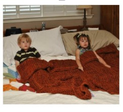
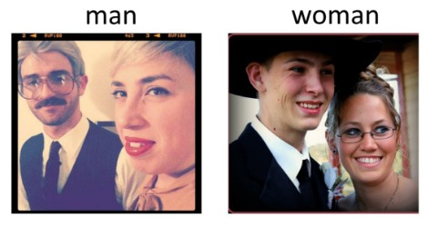
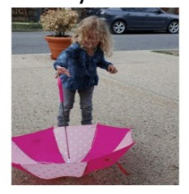

# VisualSearch - Visual LLM
This repository has 2 aspects. 
- Exploration of performance of different pipelines consisting of different LLM on VQA without explicit fune tuning.
- Based on the best performing pipeline, improve the search system for better search/recommendation system.
## Prompt-tuning of different pipelines on visual question answering.
### Visual Quesion Answering (VQA)
Visual Question Answering (VQA) is the task of answering the posed
question on the image. This is particularly challenging as the
model has to know about the image content and then use the
information to answer the question. It is significant in the field
of LLMs as it will allow the LLM models to digest image. This is an active area of research topic by researchers introduced by the paper ([VQA-Paper](https://arxiv.org/abs/1505.00468)).       
Recent models on task of VQA: [LlaVA](https://github.com/haotian-liu/LLaVA)

#### Examples on VQA task:
**Question:** How many children are there in bed ? 
|  |  |
|:----------------------:|:----------------------:|
| Answer: 2 | Answer: 1 |
          
**Question:** Who is wearing glasses in the photo ?          
         
<!-- Answer: Man (first image) , Woman (second image)         -->

**Question:** Is the umbrella upside down ?          
         
Answer: Yes          

