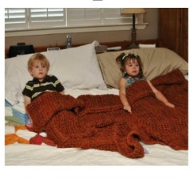
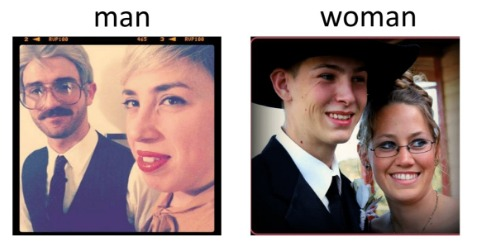
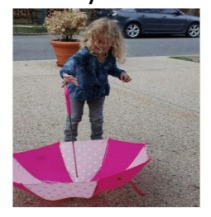

# VisualLLM - Visual Question Answering

This repository explores **Visual Question Answering (VQA)** using Large Language Models without explicit fine-tuning. The project investigates how different pipeline configurations combining vision models (BLIP, YOLO) with LLMs (Llama-2, Mistral) perform on VQA tasks through prompt engineering and in-context learning.This will be helpful for **improving image search and recommendation systems.**

**Institution:** Northeastern University    
**Focus Areas:** Visual Question Answering, Multi-modal AI, Prompt Engineering, In-Context Learning    

---

## Research Context

This project was developed as part of coursework exploring modern approaches to multi-modal AI. The work demonstrates:

✅ **Zero-shot VQA** - Answer visual questions without task-specific training    
✅ **Pipeline modularity** - Mix and match vision + language components    
✅ **Prompt engineering** - Optimize LLM performance through careful prompting    
✅ **In-context learning** - Leverage few-shot examples for improved accuracy    
✅ **Comparative analysis** - Systematic evaluation of different approaches    

---

## What is Visual Question Answering?

Visual Question Answering (VQA) is the challenging task of answering natural language questions about images. The model must understand both the visual content and the question to generate accurate answers.

**Examples:**

| Question | Image | Answer |
|----------|-------|--------|
| How many children are in bed? | { width="200" } | 2 |
| Who is wearing glasses? | { width="200" } | Man |
| Is the umbrella upside down? | { width="200" } | Yes |

This is particularly significant for making LLMs truly multi-modal and enabling them to process and reason about visual information.

## Project Overview

This research project has main aspects of pipeline performance exploration for the task of VQA which can be used to improve image search and recommendation systems.

### Pipeline Performance Exploration
Investigate different combinations of vision models and LLMs without fine-tuning:
- **Vision Models:** BLIP (image captioning), YOLO (object detection)
- **Language Models:** Llama-2-7B, Mistral-7B
- **Configurations:** BLIP+LLM, YOLO+LLM, BLIP+YOLO+LLM

---

## Key Findings

### Best Configuration Performance

| Pipeline | LLM | Exact Match | Semantic Match | Notes |
|----------|-----|-------------|----------------|-------|
| **BLIP + YOLO** | **Mistral** | **51.9%** ⭐ | **55.1%** | Best overall configuration |
| BLIP + YOLO | Llama-2 | 46.1% | **64.2%** ⭐ | Highest semantic accuracy |
| YOLO Only | Llama-2 | 47.1% | 63.0% | Best for object questions |
| BLIP Only | Llama-2 | 45.4% | 59.3% | Good for scene understanding |

**Optimal Settings:** Max 3 tokens + single-word prompt instruction

---

### Configuration Impact

| Configuration | Exact Match | Semantic Match | Improvement |
|---------------|-------------|----------------|-------------|
| Default (20 tokens) | 12.9% | 15.2% | Baseline |
| Max 3 tokens | 21.6% | 25.8% | +67% |
| **Max 3 tokens + single word prompt** | **42.9%** | **52.1%** | **+233%** ⭐ |

**Key Insight:** Proper generation configuration increases accuracy by **4×**

---

### In-Context Learning Results

| ICL Examples | Exact Match | Semantic Match | Performance |
|--------------|-------------|----------------|-------------|
| **1-shot** | **48%** | **59%** | ⭐ Best |
| 3-shot | 43-44% | 51-54% | Slight decrease |
| 5-shot | 14-24% | 18-29% | Significant drop |

**Key Insight:** More examples ≠ better performance (context relevance matters more than quantity)

---

### Model Comparison

| Comparison | Llama-2 | Mistral | Winner |
|------------|---------|---------|--------|
| BLIP pipeline | 45.4% / 59.3% | 42.9% / 52.1% | Llama-2 |
| YOLO pipeline | 47.1% / 63.0% | 29.2% / 39.6% | Llama-2 |
| **BLIP + YOLO pipeline** | 46.1% / 64.2% | **51.9% / 55.1%** | **Mistral** ⭐ |

**Key Insight:** Model performance is pipeline-dependent; Mistral excels in hybrid configurations

---

### Baseline Comparison

| Model Type | Exact Match | Semantic Match | Training Required |
|------------|-------------|----------------|-------------------|
| **BLIP-VQA** (fine-tuned) | **90.5%** | **96.1%** | Yes (supervised) |
| Our Best (BLIP+YOLO+Mistral) | 51.9% | 55.1% | No (zero-shot) |
| **Performance Gap** | **38.6%** | **41.0%** | Trade-off |

**Key Insight:** Generic pipelines achieve ~50-57% of fine-tuned performance without any task-specific training

---

## Technologies

- **Python 3.8+** - Primary programming language
- **PyTorch** - Deep learning framework
- **Transformers (Hugging Face)** - LLM inference
- **BLIP** - Image captioning model
- **YOLOv5** - Object detection
- **Llama-2-7B-chat** - Language model
- **Mistral-7B-Instruct** - Language model
- **VQA v2.0 Dataset** - Evaluation benchmark

---

## Quick Navigation

### 🏗️ Pipeline Architectures

**[Pipeline Overview](pipelines.md)** - Comparison of three distinct pipeline configurations

- **[BLIP + LLM Pipeline](blip-llm-pipeline.md)** - Caption-based approach for scene understanding
- **[YOLO + LLM Pipeline](yolo-llm-pipeline.md)** - Object detection approach for counting and identification
- **[BLIP + YOLO + LLM Pipeline](blip-yolo-llm-pipeline.md)** - Hybrid approach combining both modalities

**Key Topics:** Architecture comparison, data flow, strengths & weaknesses, use case recommendations

---

### 🧪 Experiments

**[Generation Configuration](generation-config.md)** - Impact of token limits and prompt instructions

- Max tokens optimization (20 → 3 tokens)
- Single-word instruction effectiveness
- 4x accuracy improvement through configuration

**[Prompt Templates](prompt-templates.md)** - Investigation of 7 different prompt templates

- Template design principles
- Model-aware vs. model-agnostic prompts
- Impact on accuracy (11% to 51.9% variation)

**[In-Context Learning](in-context-learning.md)** - Few-shot learning with 1, 3, and 5 examples

- Optimal example count (1-shot best)
- Context relevance vs. quantity
- Performance degradation with too many examples

**Key Topics:** Experimental methodology, optimization strategies, configuration impact

---

### 📊 [Results & Analysis](results.md)
Comprehensive experimental results with accuracy metrics and insights.

**Key Topics:** Performance tables, error analysis, model comparison, best configurations

---

### 🚀 [Development Guide](getting-started.md)
Setup instructions, usage examples, and code walkthrough.

**Key Topics:** Installation, running experiments, reproducing results, dataset preparation

---

## Repository Structure

```
VisualLLM/
├── src/                          # Source code
│   ├── blip_captions.py         # BLIP image captioning
│   ├── yolo_detections.py       # YOLO object detection
│   ├── blip_llama.py            # BLIP + Llama pipeline
│   ├── blip_mistral.py          # BLIP + Mistral pipeline
│   ├── yolo_llama.py            # YOLO + Llama pipeline
│   ├── yolo_mistral.py          # YOLO + Mistral pipeline
│   ├── blip_yolo_llama.py       # BLIP + YOLO + Llama pipeline
│   ├── blip_yolo_mistral.py     # BLIP + YOLO + Mistral pipeline
│   ├── llama_templates.py       # Prompt templates for Llama
│   ├── mistral_templates.py     # Prompt templates for Mistral
│   ├── icl.py                   # In-context learning experiments
│   └── constants.py             # Configuration constants
│
├── data/                         # Dataset and preprocessed data
│   ├── validation/              # VQA v2.0 validation set
│   ├── train/                   # VQA v2.0 training set
│   └── *.csv                    # Preprocessed captions/detections
│
├── notebooks/                    # Jupyter notebooks
│   └── Experiment.ipynb         # Exploratory analysis
│
├── results/                      # Experimental outputs
├── report/                       # Project report and figures
└── docs/                         # MkDocs documentation
```

---

## Quick Start

### Prerequisites
```bash
# Python 3.8 or higher
python --version

# Install dependencies
pip install -r src/requirements.txt
```

### Run Experiments
```bash
cd src

# Generate BLIP captions
python blip_captions.py

# Generate YOLO detections
python yolo_detections.py

# Run BLIP + YOLO + Mistral pipeline
python blip_yolo_mistral.py

# Run in-context learning experiments
python icl.py
```

For detailed setup and usage, see [Getting Started](getting-started.md).

---

## Contact

**Author:** Praphul Samavedam    
**GitHub:** [@PraphulSamavedam](https://github.com/PraphulSamavedam)    

---

## References

- **VQA Paper:** [VQA: Visual Question Answering](https://arxiv.org/abs/1505.00468)
- **BLIP:** [Bootstrapping Language-Image Pre-training](https://arxiv.org/abs/2201.12086)
- **YOLO:** [You Only Look Once](https://arxiv.org/abs/1506.02640)
- **Llama-2:** [Open Foundation and Fine-Tuned Chat Models](https://arxiv.org/abs/2307.09288)
- **Mistral:** [Mistral 7B](https://arxiv.org/abs/2310.06825)
- **LLaVA:** [Visual Instruction Tuning](https://github.com/haotian-liu/LLaVA)
